Setting up the development environment
======================================

_IMPORTANT!_ In this course, your code must be cross-platform. Follow these guidelines.

*   Always use CMake to perform an “out-of-source” build, which means that the binary files will not be in the same directory as the source files.
*   When adding new `.cpp` and `.h` files, always add them manually to the `src` folder and rerun CMake. Do not use the “add” feature of your IDE to add files to your project.
*   Do not use system-specific headers and libraries (e.g., `windows.h`).
*   In your code, use forward slashes instead of back slashes for paths (`/` instead of `\`).

Once you set up your environment properly, you should be able to run the lab code and see a teapot.

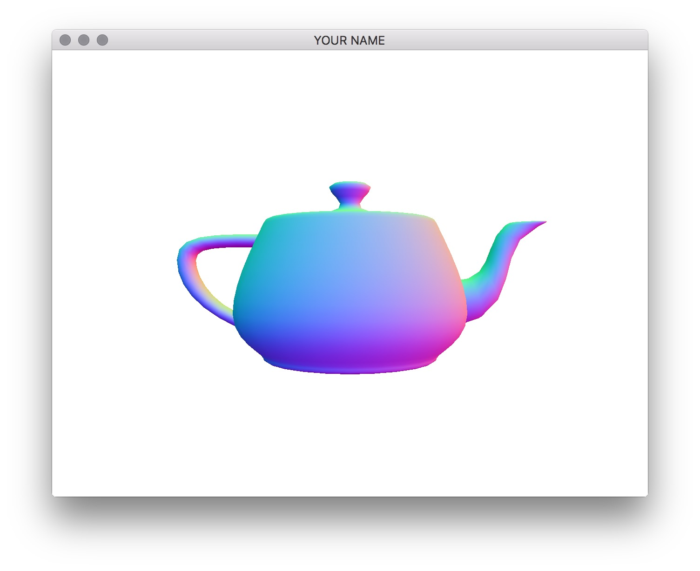

First, download (clone) the repository, and then extract the zip file to a suitable folder. Then go to the section corresponding to your development environment.

*   Windows
    *   [Install prerequisite software on Windows](#setting-up-windows)
    *   [Run with Visual Studio](#run-with-visual-studio)
*   macOS
    *   [Install prerequisite software on macOS](#setting-up-macos)
    *   [Run with Xcode](#run-with-xcode)
*   Linux
    *   [Install prerequisite software on Linux](#setting-up-linux)
    *   [Run with Makefile](#run-with-makefile)

### Miscellaneous tips:

1.  Depending on the environment, things may not go smoothly if the path contains special characters. Therefore, **you should avoid using SPACE, &, etc. in your path.**
2.  Whenever you change your environment variables, you need to restart CMake and your IDE.
3.  Because CMake caches your last-used settings, it must be cleared before running again. Run the command `rm -r *` from the `build` folder to delete the cache.


## Setting up Windows

1.  Download and install these programs.
    
    *   Visual Studio ([https://www.visualstudio.com/downloads/](https://www.visualstudio.com/downloads/)). Any recent version should work.
        *   Make sure to download _Visual C++_, not just Visual Studio.
        *   You may have to run Visual C++ at least once, before running CMake.
        *   You may find that you need to also install “Build Tools For Visual Studio,” under “Other Tools and Frameworks” on the visual studio download page.
    *   CMake ([https://cmake.org/download/](https://cmake.org/download/)): get the Windows Installer.
2.  Download and extract the following libraries. You can extract them to your coursework folder or to a system folder of your choice.
    
    *   GLM ([http://glm.g-truc.net](http://glm.g-truc.net)): get the source code.
    *   GLFW ([http://www.glfw.org](http://www.glfw.org)): get the source code.
    *   GLEW ([http://glew.sourceforge.net](http://glew.sourceforge.net)): get the Windows binaries.
3.  Set up the environment variables. This ensures that your code will work on the TA’s and the instructor’s machines.
    
    *   Search for “environment” and then select “Edit environment variables for your account.”
        
        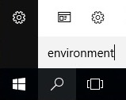 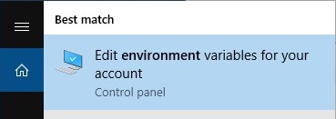
        
    *   In the dialog box, set the following environment variables. Each of the `/path/to/*` should point to the absolute path of the libraries that you just installed. These directories should be the “root” directories of the libraries – i.e., they should contain such items as `include/`, `src/`, `doc/`, `lib/`, `readme`, etc.
        
        *   Set `GLM_INCLUDE_DIR` to `/path/to/GLM`
        *   Set `GLFW_DIR` to `/path/to/GLFW`
        *   Set `GLEW_DIR` to `/path/to/GLEW`
            
            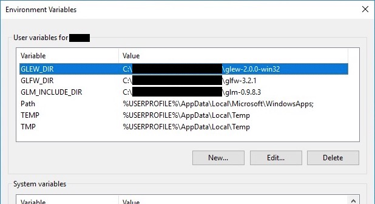
            
    *   To test your environment variables, open a PowerShell and run the following:
     
            $env:GLM_INCLUDE_DIR
            $env:GLFW_DIR
            $env:GLEW_DIR
        
        Make sure you see the correct paths in the output.
        

## Setting up macOS

This should work for Big Sur and Monterey. Earlier versions may or may not work. Both Intel and M1 Macs are supported.

1.  Download and install the following. You can use homebrew/macports or install these manually.
    
    *   Xcode developer tools. You’ll need to log in with your Apple ID.
        *   You may have to run Xcode at least once, before running CMake.
    *   CMake ([http://cmake.org/download/](http://cmake.org/download/)). Once installed, run the application and follow one of the three options listed under “Tools -> How to Install for Command Line Use”.
    
    Make sure the commands `g++` and `cmake` work from the command prompt.
    
2.  Download and extract the following libraries. You can extract them to your coursework folder or to a system folder of your choice.
    
    *   GLM ([http://glm.g-truc.net](http://glm.g-truc.net)): get the source code.
    *   GLFW ([http://www.glfw.org](http://www.glfw.org)): get the source code.
    *   GLEW ([http://glew.sourceforge.net](http://glew.sourceforge.net)): get the source code.
        *   Compile the source by typing `make -j4`. (This could take a while.)
3.  Set up the environment variables. This ensures that your code will work on the TA’s and the instructor’s machines.
    
    *   Add the following lines to your “run commands” file (`.zshrc` or `.bashrc`).
        
              export GLM_INCLUDE_DIR=ABS_PATH_TO_GLM
              export GLFW_DIR=ABS_PATH_TO_GLFW
              export GLEW_DIR=ABS_PATH_TO_GLEW
        
        If you are using zsh (Catalina default), then add the lines above to `~/.zshrc`. If you are using bash, then add the lines above to `~/.bash_profile` (or `~/.bashrc` if `.bash_profile` doesn’t exist). To find out which shell you are using, run the command `echo $SHELL` from the command prompt.
        
        Set these variables to point to the directories that you extracted GLM, GLFW, and GLEW to. These directories should be the “root” directories of the libraries – i.e., they should contain such items as `include/`, `src/`, `doc/`, `lib/`, `readme`, etc. For example, on my machine, `ABS_PATH_TO_GLM` is `/Users/yourname/lib/glm-0.9.9.6`.
        
    *   These environment variables will be set the next time you login. To make this change take effect in your current terminal, run the following
        
              source ~/.zshrc    # if you're using zsh
              source ~/.bashrc   # if you're using bash
        
    *   To test your environment variables, run the following in the terminal:
        
              echo $GLM_INCLUDE_DIR
              echo $GLFW_DIR
              echo $GLEW_DIR
        
        Make sure you see the correct paths in the output.
        

## Setting up Linux

This is for Ubuntu Linux 20.04.1 LTS. Setting up other distributions should be similar but may be slightly different.

1.  You’ll need the following if you don’t have them already.
         
    ```
    sudo apt-get update
    sudo apt-get install g++
    sudo apt-get install cmake
    sudo apt-get install freeglut3-dev
    sudo apt-get install libxrandr-dev
    sudo apt-get install libxi-dev
    sudo apt-get install libxinerama-dev
    sudo apt-get install libxcursor-dev
    ```
         
    or as a one-liner:
    ```
    sudo apt-get update && sudo apt-get install g++ cmake freeglut3-dev libxrandr-dev libxi-dev libxinerama-dev libxcursor-dev
    ```
    
    We are going to install GLM, GLFW, and GLEW manually. (You may also use a package manager to get these libraries, but please do not modify the CMake file.)
    
2.  Download and extract the following libraries. You can extract them to your coursework folder or to a system folder of your choice.
    
    *   GLM ([http://glm.g-truc.net](http://glm.g-truc.net)): get the source code.
    *   GLFW ([http://www.glfw.org](http://www.glfw.org)): get the source code.
    *   GLEW ([http://glew.sourceforge.net](http://glew.sourceforge.net)): get the source code.
        *   Compile the source by typing `make -j4`. (This could take a while.)
3.  Set up the environment variables. This ensures that your code will work on the TA’s and the instructor’s machines.
    
    *   In `~/.profile`, add the following lines.
        ```
        export GLM_INCLUDE_DIR=ABS_PATH_TO_GLM
        export GLFW_DIR=ABS_PATH_TO_GLFW
        export GLEW_DIR=ABS_PATH_TO_GLEW
        ```
        
        Set these variables to point to the directories that you extracted GLM, GLFW, and GLEW to. These directories should be the “root” directories of the libraries – i.e., they should contain such items as `include/`, `src/`, `doc/`, `lib/`, `readme`, etc.
        
    *   These environment variables will be set the next time you login. To make this change take effect in your current terminal, run the following
        ```
        source ~/.profile
        ```

    *   To test your environment variables, run the following in the terminal:
        ```
        echo $GLM_INCLUDE_DIR
        echo $GLFW_DIR
        echo $GLEW_DIR
        ```
        Make sure you see the correct paths in the output.
        

## Run with Visual Studio

0.  Extract `L00.zip` into a folder of your choice.
    
1.  Run CMake (GUI).
    
    1.  Click on “Browse Source…” and point to the folder you extracted, containing the `CMakeLists.txt` file.
    2.  Copy and paste the path from above to “Where to build the binaries.” Append “build” to it.
    3.  Click on “Configure.” Click on “Yes” if it asks if you want to create a directory. Select the Visual Studio version that is installed on your machine (e.g., “Visual Studio 16.2.5 2019”) and click on “Finish.” You should see “Configuring done” in the scroll panel.
    4.  Click on “Generate.” You should see “Generating done” in the scroll panel. Close CMake.
        
        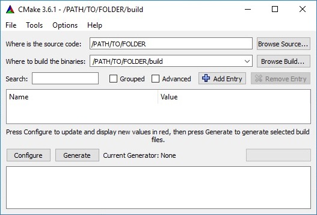
        
2.  There should now be a file called `L00.sln` in the `build` folder. Double click it to open it with Visual Studio.
    
    1.  Right-click on `L00` and select “Set as StartUp Project.”
        
        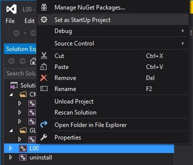
        
    2.  Right-click again on `L00` and select “Properties.” Go to “Debugging” then “Command Arguments” and then type `../resources`. Click “OK.”
        
        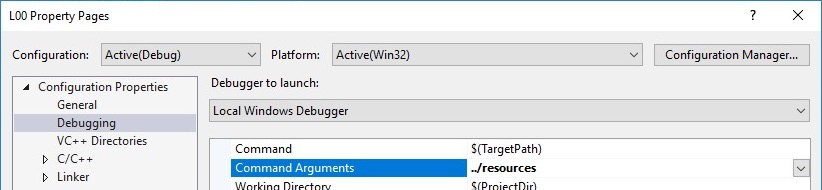
        
    3.  Go to the “Build” menu and click “Build Solution \[F7\].”
    4.  Go to the “Debug” menu and click “Start Debugging \[F5\].” You should see the teapot.
    5.  To run in Release mode, change the solution configuration by clicking on “Debug” in the drop-down menu.
        
        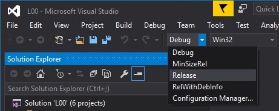
        

## Run with Xcode

0.  Extract `L00.zip` into a folder of your choice.
    
1.  In the folder that contains CMakeLists.txt, run the following.
    
        mkdir build
        cd build
    
    Then run the following _from the build folder_.
    
        cmake -G Xcode ..
    
    This will generate `L00.xcodeproj` project that you can open with Xcode.
    
2.  Open `L00.xcodeproj` with Xcode.
    
    1.  Change the target by clicking on “ALL\_BUILD” and selecting `L00`.
        
        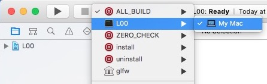
        
    2.  Edit the scheme by going to “Product” -> “Scheme” -> “Edit Scheme” to add command-line arguments (`../../resources`).
        
        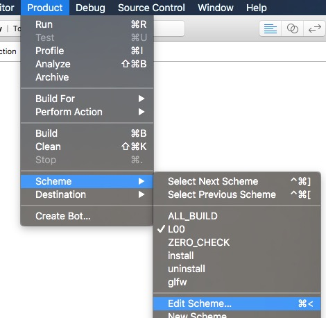
        
        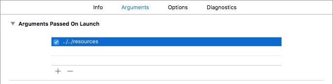
        
    3.  Press Command+B to build.
    4.  Press Command+R to run.
    5.  To run in release mode, edit the scheme again and go to the “info” tab.
        
        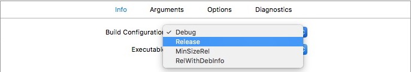
        

Run with Makefile
-----------------

0.  Extract `L00.zip` into a folder of your choice.
    
1.  In the folder that contains CMakeLists.txt, run the following.
    ```
    mkdir build
    cd build
    ```
    
    Then run the following _from the build folder_.
    ```
    cmake ..
    ```
    
    This will generate a Makefile that you can use to compile your code.
    
2.  To compile the code, run the generated Makefile.
    ```
    make -j4
    ```
    
    The `-j` argument speeds up the compilation by multithreading the compiler. This will generate an executable, which you can run by typing
    ```
    ./L00 ../resources
    ```
    
    To build in release mode:
    
    *   Rerun CMake with the build type specified: `cmake -DCMAKE_BUILD_TYPE=Release ..`
    *   OR: (requires package `cmake-curses-gui`) use `ccmake ..` and change `CMAKE_BUILD_TYPE` to `Release`. Press ‘c’ to configure then ‘g’ to generate. Now `make -j4` will build in release mode.
        
        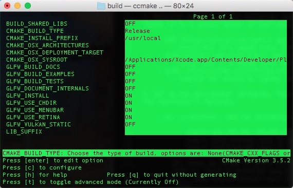
        

* * *

### Credits

This starter code and instructions is adapted from Shinjiro Sueda's computer graphics course at TAMU.
